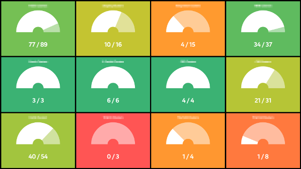

# dashbi-widget-gauge

Dashbi widget that displays gauge using [chartist.js](https://gionkunz.github.io/chartist-js/)



## Usage

### Install

```sh
npm install --save dashbi-widget-gauge
```

### Register

Dashbi should detect and auto-register widget.

### Configuration

Name | Type | Description
--- | --- | ---
`current` | String | Which state key should be used for current number
`total` | String | Which state key should be used for total number

### Example

Lets' say that `some-data-provider` provides state which has key `randomNumber` and `ofTotal`:

```js
dashbiLayout.addWidget({
  name: 'gauge',
  title: 'Cool Gauge',
  params: {
    current: 'randomNumber',
    total: 'ofTotal'
  },
  source: {
    name: 'some-data-provider'
  }
});
```

### Colors

Background of widget will change color according to `current` value.
0% will be red (#E15554), 50% yellow (#E1BC29) and 100% green (#3BB273).
